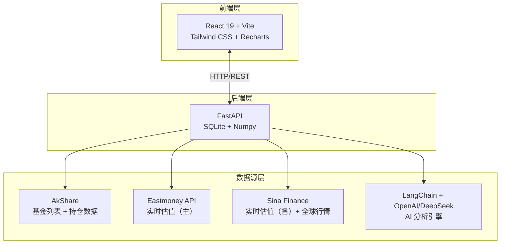

# FundVal Live


**盘中基金实时估值与逻辑审计系统**

拒绝黑箱，拒绝情绪化叙事。基于透明的持仓穿透 + 实时行情加权计算 + 硬核数学模型，让基金估值回归数学事实。

---

## 目录

- [预览](#预览)
- [快速开始](#快速开始)
  - [方式一：桌面应用（推荐）](#方式一桌面应用推荐)
  - [方式二：Docker 部署（推荐服务器部署）](#方式二docker-部署推荐服务器部署)
  - [方式三：命令行运行](#方式三命令行运行)
- [核心功能](#核心功能)
- [技术架构](#技术架构)

---

## 核心功能

### 🔐 多用户系统
- **会话认证**：基于 bcrypt + HttpOnly Cookie 的安全认证
- **用户管理**：管理员可创建/删除用户，控制注册开关
- **数据隔离**：每个用户独立的账户、持仓、交易记录、AI Prompts
- **权限控制**：管理员/普通用户角色分离

### 📊 实时估值
- **全球市场**：支持 A 股 / 港股 / 美股实时行情
- **智能识别**：自动识别 QDII 基金持仓代码格式
- **多源容灾**：天天基金 ⇄ 新浪财经自动切换
- **盘中更新**：自动采集盘中估值快照

### 📈 技术指标
基于 250 个交易日净值序列，Numpy 向量化计算：
- **夏普比率**：风险调整后收益效率
- **最大回撤**：历史极端风险审计
- **年化波动率**：持仓稳定性量化
- **数据自洽性验证**：自动检测数据异常

### 🤖 AI 深度分析
- **Linus 风格审计**：基于数学事实，拒绝情绪化叙事
- **自定义 Prompts**：每个用户可创建专属分析模板
- **持仓穿透**：分析前十大持仓股票实时表现
- **逻辑归因**：估值偏差、技术位阶、回撤特征审计

### 💼 持仓管理
- **多账户支持**：每个用户可创建多个账户
- **成本追踪**：记录成本和份额，实时计算收益
- **交易记录**：加仓/减仓按 T+1 规则自动确认
- **可视化**：组合饼图、历史走势图
- **一键同步**：持仓同步到关注列表

### 📤 数据管理
- **导入导出**：支持账户、持仓、交易、AI Prompts 导出
- **数据隔离**：每个用户只能导出自己的数据
- **合并/替换**：灵活的导入模式

### 🔔 订阅提醒
- **波动提醒**：涨跌幅超阈值邮件通知
- **每日摘要**：指定时间发送持仓汇总
- **邮件通知**：SMTP 配置

---

## 预览

### 资金看板


### 多账户管理


### 技术指标审计


### AI 深度逻辑报告


### 自定义 AI 提示词


### 数据导入导出


---

## 加入讨论群组

<div align="center">
  
  <p>扫码加入微信群，交流使用心得、反馈问题、提出建议</p>
</div>

---

## 快速开始

### 方式一：桌面应用（推荐 

**下载安装包，双击即用，无需配置环境**

#### 下载

前往 [Releases](https://github.com/Ye-Yu-Mo/FundVal-Live/releases/latest) 下载最新版本：

| 平台 | 文件 | 说明 |
|------|------|------|
| **macOS (Apple Silicon)** | `FundVal-Live-*-arm64.dmg` | M1/M2/M3 芯片 |
| **macOS (Intel)** | `FundVal-Live-*-x64.dmg` | Intel 芯片 |
| **Windows** | `FundVal-Live-Setup-*.exe` | 64位系统 |
| **Linux (AppImage)** | `FundVal-Live-*.AppImage` | 通用格式 |
| **Linux (Debian/Ubuntu)** | `fundval-live_*_amd64.deb` | deb 包 |

#### 安装

**macOS:**
1. 下载对应架构的 `.dmg` 文件
   - Apple Silicon (M1/M2/M3)：下载 `arm64` 版本
   - Intel 芯片：下载 `x64` 版本
2. 双击打开，拖动到 Applications
3. 首次打开如提示"无法验证开发者"：
   - 打开"系统偏好设置" → "安全性与隐私"
   - 点击"仍要打开"
4. 如提示"应用已损坏"，在终端执行：
   ```bash
   sudo xattr -dr com.apple.quarantine "/Applications/FundVal Live.app"
   ```

**Windows:**
1. 下载 `.exe` 文件
2. 双击安装
3. 如提示 SmartScreen：点击"更多信息" → "仍要运行"

**Linux:**
```bash
# AppImage
chmod +x FundVal-Live-*.AppImage
./FundVal-Live-*.AppImage

# Debian/Ubuntu
sudo dpkg -i fundval-live_*_amd64.deb
```

#### 数据位置

- **数据库**: `~/.fundval-live/data/fund.db`
- **配置文件**: `~/.fundval-live/config.json`
- **日志**: `~/.fundval-live/logs/`
  - `electron.log` - 应用日志
  - `backend.log` - 后端日志

#### 修改端口

如果默认端口 `21345` 被占用，可以修改配置文件：

1. 打开配置文件：`~/.fundval-live/config.json`
2. 修改端口号：
   ```json
   {
     "port": 8080
   }
   ```
3. 重启应用

**配置文件位置**：
- **macOS/Linux**: `~/.fundval-live/config.json`
- **Windows**: `C:\Users\<用户名>\.fundval-live\config.json`

---

### 方式二：Docker 部署（推荐服务器部署）

**一键部署，无需配置环境，适合服务器或 NAS**

#### 1. 安装 Docker

- **Linux**: `curl -fsSL https://get.docker.com | sh`
- **macOS/Windows**: 下载 [Docker Desktop](https://www.docker.com/products/docker-desktop)

#### 2. 启动服务

**快速体验（最简启动）**

```bash
# 拉取镜像
docker pull ghcr.io/ye-yu-mo/fundval-live:latest

# 启动服务（无 AI 分析）
docker run -d -p 21345:21345 ghcr.io/ye-yu-mo/fundval-live:latest

# 访问 http://localhost:21345
```

**完整配置（推荐生产环境）**

```bash
# 带数据持久化 + AI 分析
docker run -d \
  --name fundval-live \
  -p 21345:21345 \
  -v fundval-data:/app/backend/data \
  -e OPENAI_API_KEY=your_api_key \
  -e OPENAI_API_BASE=https://api.openai.com/v1 \
  ghcr.io/ye-yu-mo/fundval-live:latest

# 或使用 docker-compose
wget https://raw.githubusercontent.com/Ye-Yu-Mo/FundVal-Live/main/docker-compose.yml
docker-compose up -d
```

**本地构建（开发者）**

```bash
# 克隆项目
git clone https://github.com/Ye-Yu-Mo/FundVal-Live.git
cd FundVal-Live

# （可选）配置环境变量
cp .env.docker .env
# 编辑 .env 填入 API Key 等配置

# 启动服务（自动构建）
docker-compose up -d

# 查看日志
docker-compose logs -f
```

#### 3. 访问

打开浏览器访问 `http://localhost:21345`

#### 4. 管理

```bash
# 停止服务
docker-compose down

# 更新到最新版本
docker-compose pull
docker-compose up -d

# 查看状态
docker-compose ps

# 查看日志
docker-compose logs -f
```

#### 数据持久化

数据存储在 Docker volume `fundval-data` 中，即使删除容器也不会丢失。

---

### 方式三：命令行运行

**适合开发者和需要自定义配置的用户**

#### 环境要求
- Python 3.13+
- Node.js 18+
- uv (Python 包管理工具)

#### 1. 配置 AI 分析（可选）

在项目根目录创建 `.env` 文件：

```ini
# OpenAI / DeepSeek API 配置
OPENAI_API_KEY=sk-xxxxxxxx
OPENAI_API_BASE=https://api.openai.com/v1
AI_MODEL_NAME=deepseek-chat
```

#### 2. 一键启动

```bash
# 自动安装依赖 + 后台运行 + 日志记录
./start.sh

# 查看运行日志
tail -f logs/backend.log

# 停止服务
./stop.sh
```

#### 3. 访问

打开浏览器访问 `http://localhost:21345`

---

## 技术架构



**技术栈**：
- **前端**：React 19 + Vite + Tailwind CSS + Recharts + Lucide Icons
- **后端**：FastAPI + SQLite + Numpy + AkShare
- **AI**：LangChain + OpenAI/DeepSeek

---

## 核心理念

### 拒绝黑箱
估值基于透明的持仓权重与实时行情加权计算，不依赖单一滞后的第三方接口。

### 数据审计
自动清洗持仓数据，剔除重复项与零权重噪音，确保分析基座的纯净。

### 多源容灾
自动在天天基金、新浪财经等多个数据源间无缝切换，确保 QDII 及新成立基金的估值可用性。

### 数学归因
用夏普比率、最大回撤、年化波动率等硬指标替代主观的评分体系。

---

## 开源协议

本项目采用 **GNU Affero General Public License v3.0 (AGPL-3.0)** 开源协议。

**这意味着**：
- 你可以自由使用、修改、分发本软件
- 个人使用无需开源你的修改
- 如果你用本项目代码提供网络服务（SaaS），必须开源你的修改
- 衍生作品必须使用相同协议

**为什么选择 AGPL-3.0？**
- 金融工具需要透明度，用户有权知道估值逻辑
- 防止闭源商业化，确保改进回流社区
- 保护开源生态，避免"拿来主义"

详见 [LICENSE](LICENSE) 文件。

---

## 免责声明

本项目提供的数据与分析仅供技术研究使用，不构成任何投资建议。市场有风险，代码无绝对，交易需谨慎。

---

## Star History

[](https://www.star-history.com/#Ye-Yu-Mo/FundVal-Live&type=date&legend=top-left)
