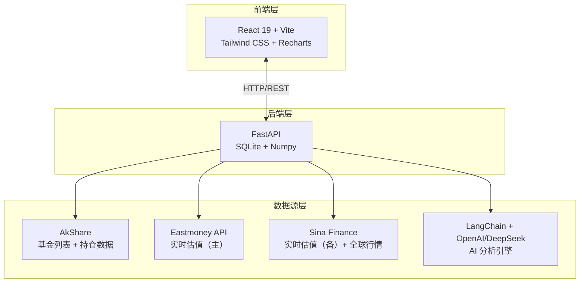

# FundVal Live


**盘中基金实时估值与逻辑审计系统**

拒绝黑箱，拒绝情绪化叙事。基于透明的持仓穿透 + 实时行情加权计算 + 硬核数学模型，让基金估值回归数学事实。

---

## 预览

### 资金看板


### 持仓管理


### 技术指标审计


### AI 深度逻辑报告


---

## 快速开始

### 方式一：桌面应用（推荐 

**下载安装包，双击即用，无需配置环境**

#### 下载

前往 [Releases](https://github.com/Ye-Yu-Mo/FundVal-Live/releases/latest) 下载最新版本：

| 平台 | 文件 | 说明 |
|------|------|------|
| **macOS (Apple Silicon)** | `FundVal-Live-*-arm64.dmg` | M1/M2/M3 芯片 |
| **macOS (Intel)** | `FundVal-Live-*-x64.dmg` | Intel 芯片 |
| **Windows** | `FundVal-Live-Setup-*.exe` | 64位系统 |
| **Linux (AppImage)** | `FundVal-Live-*.AppImage` | 通用格式 |
| **Linux (Debian/Ubuntu)** | `fundval-live_*_amd64.deb` | deb 包 |

#### 安装

**macOS:**
1. 下载 `.dmg` 文件
2. 双击打开，拖动到 Applications
3. 首次打开如提示"无法验证开发者"：
   - 打开"系统偏好设置" → "安全性与隐私"
   - 点击"仍要打开"

**Windows:**
1. 下载 `.exe` 文件
2. 双击安装
3. 如提示 SmartScreen：点击"更多信息" → "仍要运行"

**Linux:**
```bash
# AppImage
chmod +x FundVal-Live-*.AppImage
./FundVal-Live-*.AppImage

# Debian/Ubuntu
sudo dpkg -i fundval-live_*_amd64.deb
```

#### 数据位置

- **数据库**: `~/.fundval-live/data/fund.db`
- **日志**: `~/.fundval-live/logs/`
  - `electron.log` - 应用日志
  - `backend.log` - 后端日志

---

### 方式二：命令行运行

**适合开发者和需要自定义配置的用户**

#### 环境要求
- Python 3.13+
- Node.js 18+
- uv (Python 包管理工具)

#### 1. 配置 AI 分析（可选）

在项目根目录创建 `.env` 文件：

```ini
# OpenAI / DeepSeek API 配置
OPENAI_API_KEY=sk-xxxxxxxx
OPENAI_API_BASE=https://api.openai.com/v1
AI_MODEL_NAME=deepseek-chat
```

#### 2. 一键启动

```bash
# 自动安装依赖 + 后台运行 + 日志记录
./start.sh

# 查看运行日志
tail -f logs/backend.log

# 停止服务
./stop.sh
```

#### 3. 访问

打开浏览器访问 `http://localhost:5173`

---

## 核心功能

### 全球市场盘中估值
- 支持 **A 股 / 港股 / 美股** 实时行情
- 自动识别 QDII 基金持仓代码格式
- 多源容灾（天天基金 ⇄ 新浪财经）

### 硬核技术指标
基于 250 个交易日净值序列，Numpy 向量化计算：
- **夏普比率** — 风险调整后收益效率
- **最大回撤** — 历史极端风险审计
- **年化波动率** — 持仓稳定性量化

### Linus 风格 AI 审计
不复述新闻舆情，只基于数学事实：
- 估值偏差分析
- 技术位阶判断
- 回撤特征审计
- 直接输出 **持有 / 止盈 / 定投** 指令

### 持仓管理
- 记录成本和份额
- 实时计算持有收益
- 组合可视化（饼图）
- 一键同步到关注列表

### 订阅提醒
- 波动提醒（涨跌幅超阈值）
- 每日摘要（指定时间发送）
- 邮件通知（SMTP）

---

## 技术架构



**技术栈**：
- **前端**：React 19 + Vite + Tailwind CSS + Recharts + Lucide Icons
- **后端**：FastAPI + SQLite + Numpy + AkShare
- **AI**：LangChain + OpenAI/DeepSeek

---

## 核心理念

### 拒绝黑箱
估值基于透明的持仓权重与实时行情加权计算，不依赖单一滞后的第三方接口。

### 数据审计
自动清洗持仓数据，剔除重复项与零权重噪音，确保分析基座的纯净。

### 多源容灾
自动在天天基金、新浪财经等多个数据源间无缝切换，确保 QDII 及新成立基金的估值可用性。

### 数学归因
用夏普比率、最大回撤、年化波动率等硬指标替代主观的评分体系。

---

## 免责声明

本项目提供的数据与分析仅供技术研究使用，不构成任何投资建议。市场有风险，代码无绝对，交易需谨慎。

---

## Star History

[](https://www.star-history.com/#Ye-Yu-Mo/FundVal-Live&type=date&legend=top-left)
